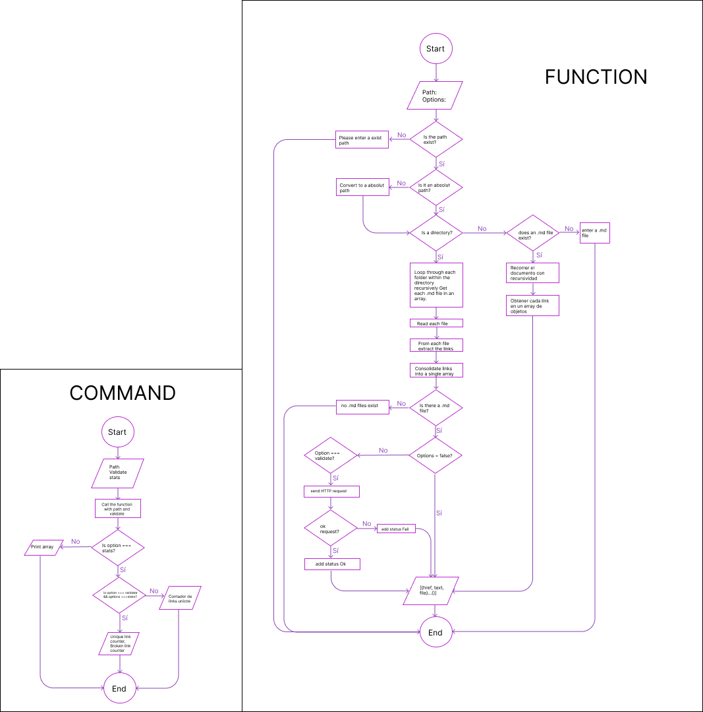

# Markdown Links

## Index

* [1. Preamble](#1-Preamble)
* [2. Flowchart](#2-Flowchart)
* [3. Installation](#3-Installation)
* [4. Usage](#4-Usage)
* [5. Author](#5-Author)

***

## 1. Preamble

[Markdown](https://en.wikipedia.org/wiki/Markdown) is a very popular lightweight markup language among developers. It is used in many platforms that handle plain text (GitHub, forums, blogs, ...), and it is very common to find several files in this format in any type of repository (starting with the traditional `README.md`).

These `Markdown` files usually contain _links_ that are often broken or no longer valid, and this greatly impairs the value of the information to be shared.

Within an open source community, we have been proposed to create a tool using [Node.js](https://nodejs.org/), which reads and analyzes files in `Markdown` format, to verify the links they contain and report some stats.

## 2. Flowchart


## 3. Installation
**CLI:** `npm i @milates12/md-links`

## 4. Usage

### **JavaScript API**
The module must be imported into the Node.js scripts as follows:

`mdLinks(path, options)`

```js
const { mdLinks } = require('@milates12/md-links');
mdLinks('./Music', { validate: false });
```
##### Arguments

* `path`: **Absolute** or **relative** path to the **file** or **directory**.
* `options`: An object with the following properties:
   - `validate`: Boolean that determines if you want to validate the links
     found.
    - `stats`: Boolean that determines if you want to know the total and unique links.

##### Return value
With `validate: false` :

* `href`: URL found.
* `text`: Text that appeared inside the link (`<a>`).
* `file`: Path of the file where the link was found.

With `validate: true` :

* `href`: URL found.
* `text`: Text that appeared inside the link (`<a>`).
* `file`: Path of the file where the link was found.
* `status`: HTTP response code.
* `ok`: Message `fail` on failure or `ok` on success.

With `stats: true` :
* `total`: Links found in directory or file.
* `unique`: Unique links in the file or directory.

With `validate:true, stats: true`:
* `total`: Numbers of links found in directory or file.
* `unique`: Number of unique links in the file or directory.
* `broken`: Number of broken links in the file or directory.

##### Example (results as comments)

```js
const mdLinks = require("md-links");

mdLinks("./some/example.md")
    // => [{ href, text, file }, ...]

mdLinks("./some/example.md", { validate: true })
    // => [{ href, text, file, status, ok }, ...]

mdLinks("./some/dir")
    // => [{ href, text, file }, { href2, text2, file2 } ...]

mdLinks("./some/example.md", { stats: true })
    // => [{ total, unique }, ...]

mdLinks("./some/example.md", { validate: true, stats: true })
    // => [{ total, unique, broken }, ...]
```
### **CLI:**

The executable of our application is executed as follows through the **terminal**:

`md-links <path-to-file> [options]`

Example result without options:
```sh
$ md-links ./some/example.md
[
  {./some/example.md http://something.com/2/3/ link to something},  
  {./some/example.md https://another-thing/algun-doc.html some doc}, 
  {./some/example.md http://google.com/ Google}
]
```
Example result with option `--validate`:

```sh
[
  {./some/example.md http://something.com/2/3/ link to something 200 'OK'},  
  {./some/example.md https://another-thing/algun-doc.html some doc 404 'FAIL'}, 
  {./some/example.md http://google.com/ Google 200 'OK'}
]
```
Example result with option `--stats`:

```sh
$ md-links ./some/example.md --stats
Total: 3
Unique: 3
```
Example result with option `--stats --validate`:

```sh
$ md-links ./some/example.md --stats --validate
Total: 3
Unique: 3
Broken: 1
```

## 5. Author

Camila Cortés. (MIT License)

